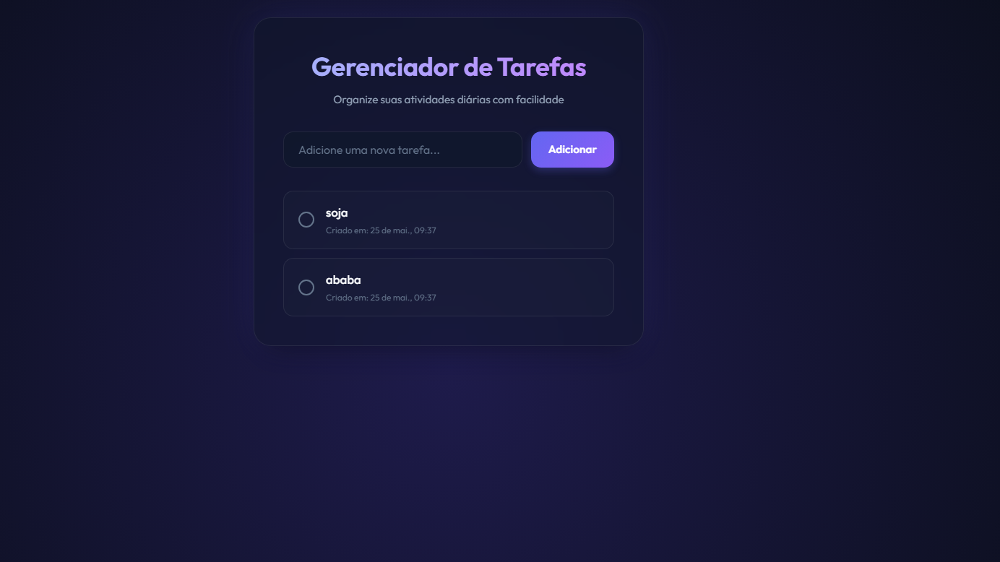
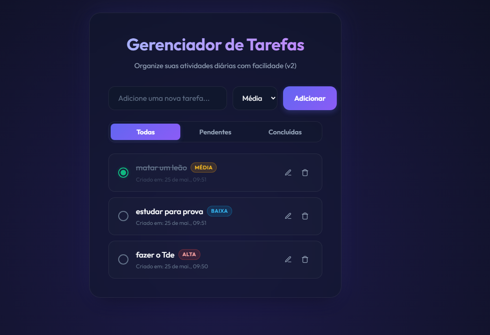

# 📋 Gerenciador de Tarefas — To-Do List
## Desenvolvido com React + TypeScript + Spec Driven Development

Um gerenciador de tarefas elegante, responsivo e de alto desempenho projetado para auxiliar usuários na organização de suas atividades diárias. Desenvolvido sob a metodologia **Spec Driven Development (SDD)**, combinando especificações detalhadas com testes automatizados e ciclos iterativos.

---

## 🎯 Visão Geral

Este projeto demonstra as melhores práticas de desenvolvimento web moderno, incluindo:

- ✅ **Especificação Detalhada** - Requisitos claros e testáveis desde o início
- 🧪 **Testes Completos** - Unitários e End-to-End automatizados
- 🎨 **Design Responsivo** - Interface moderna com glassmorphism e animações suaves
- 💾 **Persistência Local** - Dados salvos automaticamente no navegador
- 🚀 **Performance Otimizada** - Build com Vite e tipagem estática do TypeScript

---

## 🛠️ Tecnologias

| Tecnologia | Propósito | Versão |
|-----------|----------|--------|
| **React** | Framework UI | 19.2.6+ |
| **TypeScript** | Tipagem estática | 6.0.2+ |
| **Vite** | Build tool & Dev Server | 8.0.12+ |
| **Vitest** | Testes Unitários | 4.1.7+ |
| **Cypress** | Testes E2E | 15.15.0+ |
| **CSS3** | Estilização (Vanilla) | Puro |
| **OpenSpec** | SDD Tooling | - |

---

## 📁 Estrutura do Projeto

```
P2-Sistemas-/
├── 📂 src/                           # Código-fonte da aplicação
│   ├── 📂 components/                # Componentes React reutilizáveis
│   │   ├── TodoFilter.tsx            # Botões de filtro por status
│   │   ├── TodoForm.tsx              # Formulário de entrada de tarefas
│   │   ├── TodoItem.tsx              # Visualização e edição de tarefa
│   │   └── TodoList.tsx              # Container da lista
│   ├── 📂 assets/                    # Imagens e recursos estáticos
│   ├── App.tsx                       # Componente principal (gerenciador de estado)
│   ├── App.css                       # Estilos da aplicação
│   ├── index.css                     # Design system global (variáveis, animações)
│   ├── main.tsx                      # Ponto de entrada React
│   ├── types.ts                      # Declarações de tipos TypeScript
│   ├── todoLogic.ts                  # Lógica de negócio (pure functions)
│   └── todo.test.ts                  # Testes unitários com Vitest
│
├── 📂 cypress/                       # Testes End-to-End
│   └── e2e/
│       └── todo.cy.ts                # Suite de testes Cypress
│
├── 📂 openspec/                      # Especificações OpenSpec
│   ├── changes/                      # Histórico de alterações
│   └── specs/                        # Especificações consolidadas
│
├── 📂 prints_Das_Etapas/             # Evidências do projeto
│   ├── Etapa_01.png                  # Interface v1
│   └── Etapa_02.png                  # Interface v2
│
├── 📄 spec-v1.md                     # Especificação Versão 1 (MVP)
├── 📄 spec-v2.md                     # Especificação Versão 2 (Evolução)
├── 📄 package.json                   # Dependências e scripts
├── 📄 tsconfig.json                  # Configurações TypeScript
├── 📄 tsconfig.app.json              # TypeScript para app
├── 📄 tsconfig.node.json             # TypeScript para ferramentas
├── 📄 vite.config.ts                 # Configurações Vite
├── 📄 cypress.config.ts              # Configurações Cypress
├── 📄 eslint.config.js               # Regras de linting
└── 📄 index.html                     # Entry point HTML
```

---

## 🚀 Instalação e Execução

### Pré-requisitos
- **Node.js** 16.x ou superior ([Download](https://nodejs.org/))
- **npm** ou **yarn** (inclusos com Node.js)

### 1️⃣ Clonar o Repositório
```bash
git clone https://github.com/LucasGTXfeb/P2-Sistemas-.git
cd P2-Sistemas-
```

### 2️⃣ Instalar Dependências
```bash
npm install
```

### 3️⃣ Iniciar o Servidor de Desenvolvimento
```bash
npm run dev
```
A aplicação estará disponível em: **`http://localhost:5173/`**

---

## 🧪 Testes

### Testes Unitários (Vitest)
Valida a lógica de negócio isoladamente:

```bash
npx vitest
```

**Cobertura**: 8 regras de negócio principais

### Testes E2E (Cypress)
Simula interações completas no navegador:

```bash
# Interface gráfica interativa
npx cypress open

# Execução headless (terminal)
npx cypress run
```

**Cenários**: Cadastro, edição, exclusão, filtros e persistência

---

## 📋 Funcionalidades Principais

### ✅ RF01 - Cadastrar Tarefas
- Entrada de texto para título (obrigatório)
- Seletor de prioridade (Baixa, Média, Alta)
- Prioridade padrão: **Média**
- Status inicial: **Pendente**

### ✅ RF02 - Listar e Filtrar
- Filtros: **Todas**, **Pendentes**, **Concluídas**
- Filtro padrão: **Todas**
- Exibição de: título, data, status, prioridade

### ✅ RF03 - Editar Tarefas
- Modo edição inline
- Editáveis: título e prioridade
- Data de criação preservada
- Validação de campos vazios

### ✅ RF04 - Excluir Tarefas
- Remoção imediata e irreversível
- Atualização automática do estado

### ✅ RF05 - Marcar Concluído/Pendente
- Toggle de status com uma clique
- Visual feedback imediato

### ✅ RF06 - Persistência Local
- Dados salvos em `localStorage`
- Recuperação automática ao recarregar
- Sincronização em tempo real

---

## 🎨 Design System

### Paleta de Cores

| Variável | Cor | Uso |
|----------|-----|-----|
| `--accent-primary` |  Sky Blue | Botões, links, focos |
| `--accent-secondary` |  Cyan | Gradientes, destaques |
| `--success` |  Green | Confirmação, check |
| `--error` |  Red | Erros, exclusão |
| `--warning` |  Amber | Prioridade média |

### Componentes de Interface

- **Glass Panels**: Efeito glassmorphism com blur
- **Badges de Prioridade**: Codificação por cor (Baixa, Média, Alta)
- **Checkboxes Customizadas**: Design moderno com animações
- **Botões Interativos**: Feedback visual em hover/focus
- **Animações**: Fade-in, slide-in, shake (validação)

---

## 📝 Documentos de Especificação

### [spec-v1.md](./spec-v1.md)
Especificação inicial para o **MVP (Minimum Viable Product)**:
- Requisitos básicos (cadastro, listagem, conclusão)
- Critérios de aceite
- Cenários de uso iniciais

### [spec-v2.md](./spec-v2.md)
Especificação evolutiva com **recursos avançados**:
- Edição de tarefas (novo)
- Exclusão de tarefas (novo)
- Filtros por status (evolução)
- Persistência local (novo)
- 6 requisitos funcionais com 12+ cenários de teste

---

## 📸 Evidências do Projeto

### Etapa 1 - Versão 1


**Interface Básica**:
- Formulário simples de cadastro
- Lista de tarefas com status
- Botão para adicionar

### Etapa 2 - Versão 2


**Interface Avançada**:
- Filtros por status
- Níveis de prioridade com badges
- Edição inline de tarefas
- Botões de exclusão
- Design refatorado com glassmorphism

---

## 🧠 Reflexão: SDD e Desenvolvimento com IA

### O Impacto da Especificação

A evolução entre **Versão 1** (spec-v1.md) e **Versão 2** (spec-v2.md) demonstrou claramente os benefícios do **Spec Driven Development**:

✅ **Clareza de Requisitos** - Especificações detalhadas eliminam ambiguidades  
✅ **Testes Automáticos** - Cenários da spec viram testes executáveis  
✅ **Iteração Controlada** - Mudanças são planejadas e rastreáveis  
✅ **Qualidade de Código** - Requisitos claros geram código mais limpo  

### Parceria com IA (Pair Programming)

O desenvolvimento foi potencializado com inteligência artificial atuando como **pair programmer**:

- **Refinamento de Especificações** - Auxílio na estruturação e detalhe dos requisitos
- **Geração de Testes** - Testes automatizados mapeados a partir dos cenários
- **Implementação** - Código-fonte desenvolvido respeitando a especificação
- **Revisão Contínua** - Feedback iterativo para melhorias

### Resultado

Um projeto de **qualidade de produção** que demonstra:
- Profissionalismo no planejamento (SDD)
- Código testado e confiável
- Documentação completa
- Código mantível e escalável

---

## 📚 Scripts Disponíveis

```bash
# Desenvolvimento
npm run dev              # Inicia servidor com hot-reload

# Build
npm run build           # Compila para produção

# Testes
npx vitest              # Testes unitários com watch mode
npx vitest run          # Testes unitários (uma execução)

# Testes E2E
npx cypress open        # Interface gráfica Cypress
npx cypress run         # Testes headless

# Qualidade
npm run lint            # ESLint
npm run preview         # Preview da build

```

---

## 🔒 Validações Implementadas

### Validação de Entrada
- ✅ Título não pode ser vazio ou só espaços
- ✅ Mensagens de erro em tempo real
- ✅ Feedback visual com shake animation

### Validação de Estado
- ✅ Prioridade padrão = Média
- ✅ Status inicial = Pendente
- ✅ Data de criação não é alterada
- ✅ Sincronização localStorage automática

### Validação de Comportamento
- ✅ Cancelamento de edição restaura valores originais
- ✅ Exclusão é irreversível
- ✅ Filtros funcionam corretamente
- ✅ Recarregamento mantém estado

---

## 🎓 Lições Aprendidas

1. **Especificações são contratos** - Defini-las bem economiza retrabalho
2. **Testes criam confiança** - Code coverage completo aumenta velocidade
3. **Design system centralizado** - CSS com variáveis facilita manutenção
4. **IA como ferramenta** - Potencia produtividade quando bem integrada
5. **Iteração controlada** - v1 → v2 foi mais fácil com SDD

---

## 📞 Suporte

Para dúvidas ou sugestões sobre o projeto:
- 📧 Abra uma [issue](https://github.com/LucasGTXfeb/P2-Sistemas-/issues)
- 💬 Consulte as documentações (spec-v1.md, spec-v2.md)
- 📖 Verifique os testes para exemplos de uso

---

## 📄 Licença

Este projeto é fornecido como é, para fins educacionais e de demonstração.

---

**Desenvolvido com ❤️ e IA como pair programmer**

*Última atualização: 2026-06-08*
